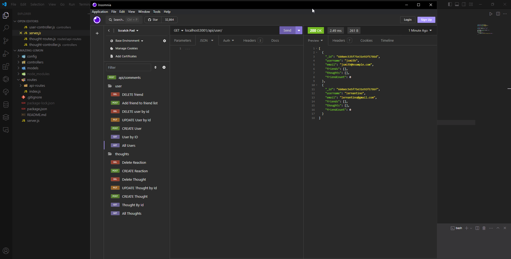

<a name="readme-top"></a>


<!-- PROJECT LOGO -->
<br />
<div align="center">
  

<h1 align="center">Social-Network|Backend Wizard</h1>

  <p align="center">
    A functioning backend for a social media webapp!. 
    <br />
    <a href="https://github.com/sbanati/e-commerce-backend"><strong>Explore the docs »</strong></a>
    <br />
    <br />

    

  </p>
</div>


<!-- TABLE OF CONTENTS -->
<details>
  <summary>Table of Contents</summary>
  <ol>
    <li>
      <a href="#about-the-project">About The Project</a>
      <ul>
        <li><a href="#built-with">Built With</a></li>
      </ul>
    </li>
    <li>
      <a href="#getting-started">Getting Started</a>
      <ul>
        <li><a href="#installation">Installation</a></li>
      </ul>
    </li>
    <li><a href="#usage">Usage</a></li>
    <li><a href="#additions">Additions</a></li>
    <li><a href="#contributing">Contributing</a></li>
    <li><a href="#acknowledgement">Acknowledgement</a></li>
    <li><a href="#contact">Contact</a></li>
  </ol>
</details>


<!-- ABOUT THE PROJECT -->
## About The Project

This application enables users to interact with an API for a social network web application where users can share their thoughts, react to friends’ thoughts, and create a friend list.    
<br><br>
 

 


<p align="right">(<a href="#readme-top">back to top</a>)</p>


### Built With

* 
* 
* 
* 
* 
* 
* 
  


  


<p align="right">(<a href="#readme-top">back to top</a>)</p>


<!-- GETTING STARTED -->
## Getting Started


### Installation
Clone the repo below and open the project in your source code editor. Open the terminal, execute "npm install" to ensure all required packages are installed. Setup Mongodb on your machine and optional is MongoDB Compass as a database GUI. Once this is done, initiate the application by running "npm start" in the terminal. <br>

1. Clone the repo
   ```sh
   https://github.com/sbanati/amazing-lemon.git
   ```
2. Install npm packages in terminal 
   ```sh
   npm install
   ```
3. Install mongodb on your machine and setup MongoDBCompass to view your database  
   ```sh
   https://www.mongodb.com/docs/manual/tutorial/install-mongodb-on-windows/
   ```
4. Start Server  
   ```sh
   npm run start
   ```

<p align="right">(<a href="#readme-top">back to top</a>)</p>


<!-- USAGE EXAMPLES -->
## Usage

<h3>Demo Video of social-network-backend.</h3>

https://www.youtube.com/watch?v=3Qst3kEQlFs

### The working endpoints are listed below, these are the endpoints you can test 

* GET /api/user - get all users
* GET /api/user/:userId - get a single user by ID
* POST /api/user - create a new user
* PUT /api/user/:userId - update a user by ID
* DELETE /api/user/:userId - delete a user by ID
* GET /api/thought - get all thought
* GET /api/thought/:thoughtId - get a single thought by ID
* POST /api/thought - create a new thought
* PUT /api/thought/:thoughtId - update a thought by ID
* DELETE /api/thought/:thoughtId - delete a thought by ID
* POST /api/thought/:thoughtId/reactions - add a reaction to a thought
* DELETE /api/thought/:thoughtId/reactions/:reactionId - remove a reaction from a thought
* POST /api/user/:userId/friends/:friendId - add a friend to a user's friend list
* DELETE /api/user/:userId/friends/:friendId - remove a friend from a user's friend list


<p align="right">(<a href="#readme-top">back to top</a>)</p>


<!-- ROADMAP -->
## Additions

<h3>Possible features</h3>

* Possibly create a front end to connect this back end to 
 

<p align="right">(<a href="#readme-top">back to top</a>)</p>


<!-- CONTRIBUTING -->
## Contributing

This part of the readme is where community involvement can happen! Normally I would have my Github setup to where anyone can fork and push or make an issue, but 
I am still learning that stuff. In the mean time this is how the section would look like. Pretty much from the Template. <br>

Contributions are what make the open source community such an amazing place to learn, inspire, and create. Any contributions you make are **greatly appreciated**.
If you have a suggestion that would make this better, please fork the repo and create a pull request. You can also simply open an issue with the tag "enhancement".


1. Fork the Project
2. Create your Feature Branch (`git checkout -b feature/NewFeature`)
3. Commit your Changes (`git commit -m 'Added some Goated new feature'`)
4. Push to the Branch (`git push origin feature/NewFeature`)
5. Open a Pull Request

<p align="right">(<a href="#readme-top">back to top</a>)</p>


<!-- ACKNOWLEDGEMENT -->
## Acknowledgement
* TA Sachin
* Pair programmed with Salvatore 
  


<p align="right">(<a href="#readme-top">back to top</a>)</p>


<!-- CONTACT -->
## Contact

Twitter and email - [@twitter_TherealSLVR](https://twitter.com/TherealSLVR) - smbanati@gmail.com

Project Link: https://github.com/sbanati/amazing-lemon

<p align="right">(<a href="#readme-top">back to top</a>)</p>


<!-- MARKDOWN LINKS & IMAGES -->
<!-- https://www.markdownguide.org/basic-syntax/#reference-style-links -->
References:
* https://dev.to/envoy_/150-badges-for-github-pnk#skills (for badges)
* https://github.com/othneildrew/Best-README-Template (best readme template, given to me by the Grader from challenge 1!😊)
* Used the Expert Learning Assistant when I was stuck
* My TA Sachin helped me with talking through the code and some bug fixes
